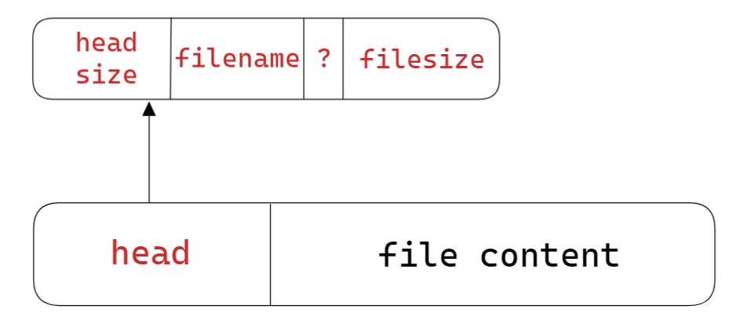
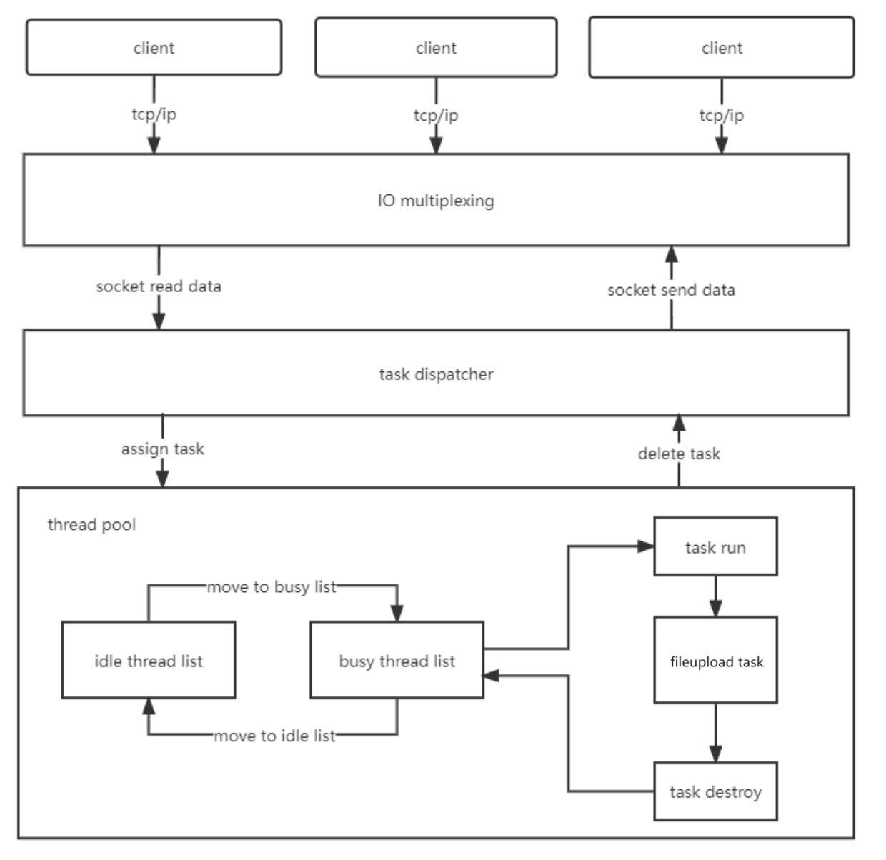
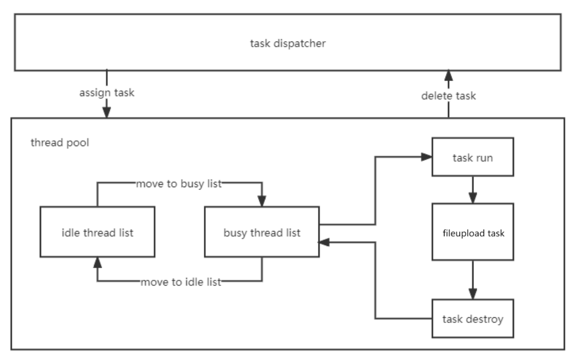

# TCP_fileupload

基于 TCP 实现的文件上传，支持多客户端连接以及上传大文件。[[视频演示]](视频演示.mp4)

## 文件传输数据格式



- `head`：数据头
  - `head size`：`size_t`，数据头的大小，防止与文件内容发生粘包
  - `filename`：`string`，文件名
  - `?`：`char`，分隔符
  - `filesize`：`uint64_t`，文件内容的字节数
- `file content`：文件内容

## 服务端

### 架构设计

采用了线程池、非阻塞 socket、IO 多路复用 epoll 以及 reactor 事件处理模型



### 代码结构

```sh
fileupload_server
  ├─config		# 配置文件
  ├─frame		# 服务器启动流程
  ├─socket		# 网络模块：IO 多路复用 epoll 实现
  ├─task		# 接收文件执行逻辑
  ├─thread		# 线程池和任务队列
  └─utility		# 工具类
```

### 执行流程

- 初始化：读取配置文件、配置日志系统、创建线程池和任务队列、绑定 IP 和端口开启监听模式。
- 当有连接请求时，将连接套接字加入监听队列。
- 当有套接字可读时，在 `TaskFactory` 类中维护的 `map` 中寻找是否有该套接字对应的任务，如果没有则为其创建一个 `FileuploadTask`，同时将该任务交给 `TaskDispatcher` 线程。
  -  `TaskDispatcher` 线程负责进行任务的分发。当有新的任务到达时，它会先检查线程池中是否有空闲的工作线程。如果有空闲线程，则将任务指派给其中一个空闲线程进行处理。如果线程池中没有空闲线程，那么任务将被放入任务队列中，等待有空闲线程时再进行处理。如果任务队列为空，就等待条件变量的触发。
  -  `FileuploadTask` 负责处理文件接收。当成员变量 `m_head_len == 0`，表明是第一次处理该连接套接字的请求，需要进行数据头解析，获取文件名和文件大小，同时创建文件并将文件内容保存。如果是接收大文件，那么对 `FileuploadTask` 的一次处理可能无法接收完成，不过之后由于成员变量 `m_head_len > 0`，直接将接收到的文件内容继续保存即可。

### 接收文件核心逻辑

`./fileupload_server/task/fileupload_task.cpp`

```cpp
/*
private:
	// socket 信息
	int m_sockfd = 0;
	bool m_closed = false;

	// 文件信息
	std::ofstream m_recv_file;
	string m_filename;
	uint64_t m_total_len;
	size_t m_head_len;
	uint64_t m_file_len;
*/

void FileuploadTask::run()
{
    log_debug("fileupload task run: conn=%d", m_sockfd);

    // 接收客户端的数据
    char buf[recv_buff_size] = { 0 };
    Socket socket(m_sockfd);
    int len = socket.recv(buf, sizeof(buf));
    if (len < 0)
    {
       if (errno == EAGAIN || errno == EWOULDBLOCK)
       {
          log_debug("socket recv would block: conn=%d", m_sockfd);
          return;
       }
       else if (errno == EINTR)
       {
          log_debug("socket recv interrupted: conn=%d", m_sockfd);
          return;
       }
       log_debug("socket connection abort: conn=%d", m_sockfd);
       fail();
       m_closed = true;
       return;
    }
    else if (len == 0)
    {
       log_debug("socket closed by peer: conn=%d", m_sockfd);
       fail();
       m_closed = true;
       return;
    }

    log_debug("recv: conn=%d msg=\n%s", m_sockfd, buf);

    m_total_len += len;
    log_debug("recv: conn=%d total_len=%llu", m_sockfd, m_total_len);
    if (m_head_len == 0)
    {
       memcpy(&m_head_len, buf, sizeof(size_t));
       log_info("recv head size=%zu", m_head_len);

       string file_info(buf + sizeof(size_t), m_head_len - sizeof(size_t));
       size_t sep_pos = file_info.find('?');
       if (sep_pos != string::npos)
       {
          // 防止重名
          std::size_t point_pos = file_info.find_last_of('.');
          m_filename = file_info.substr(0, point_pos) + '-' + generateRandomString(8)
             + file_info.substr(point_pos, sep_pos - point_pos);

          string file_size_str = file_info.substr(sep_pos + 1);
          memcpy(&m_file_len, file_size_str.c_str(), sizeof(uint64_t));
       }
       else
       {
          log_error("Invalid file info: conn=%d", m_sockfd);
          m_closed = true;
          fail();
          return;
       }

       log_info("recv file head size=%zu, file-name=%s, file-size=%llu", m_head_len, m_filename.c_str(), m_file_len);
       if (m_file_len > 0)
       {
          m_recv_file = std::ofstream(m_filename.c_str(), std::ios::binary);
          m_recv_file.write(buf + m_head_len, len - m_head_len);
       }
    }
    else
    {
       m_recv_file.write(buf, len);
    }

    if (m_total_len - m_head_len >= m_file_len)
    {
       log_info("recv file complete: file-name=%s, file-size=%llu", m_filename.c_str(), m_file_len);
       m_recv_file.close();
       string msg = "recv file complete!\r\n";
       socket.send(msg.c_str(), msg.size());
       reset();
    }
}
```

## 客户端

### 代码结构

```sh
fileupload_client
  ├─socket		# 网络模块
  └─utility		# 工具类
```

### 发送文件核心逻辑

`./fileupload_client/socket/client_socket.cpp`

```cpp
bool ClientSocket::send_file(const string& filename)
{
	std::ifstream file(filename, std::ios::binary);
	if (!file.is_open())
	{
		log_error("open file error: errno=%d errmsg=%s", errno, strerror(errno));
		return false;
	}

	/* send file head */
	size_t index = 0;
	char head[256] = { 0 };

	// 获取文件大小
	file.seekg(0, std::ios::end);
	uint64_t fileSize = file.tellg();
	file.seekg(0, std::ios::beg);

	// 分隔符
	char sep = '?';

	// 数据头长度
	size_t headSize = sizeof(size_t) + filename.size() + sizeof(char) + sizeof(uint64_t);

	// 构造数据头
	memcpy(head + index, (char*)(&headSize), sizeof(size_t));
	index += sizeof(size_t);
	memcpy(head + index, filename.c_str(), filename.size());
	index += filename.size();
	memcpy(head + index, (char*)(&sep), sizeof(char));
	index += sizeof(char);
	memcpy(head + index, (char*)(&fileSize), sizeof(uint64_t));
	index += sizeof(uint64_t);
	log_info("head size: %zu, file size: %llu", headSize, fileSize);
	send(head, index);

	// 发送文件内容
	Progress progress(fileSize); // 进度显示

	char buffer[send_buff_size] = { 0 };
	uint64_t len = 0;
	while (file.read(buffer, sizeof(buffer)))
	{
		size_t bytesRead = file.gcount(); // 获取上一次读取的字节
		len += bytesRead;
		send(buffer, bytesRead);
		memset(buffer, 0, sizeof(buffer));
		progress.updateProgress(len);
	}
	int bytesRead = file.gcount(); // 获取上一次读取的字节
	len += bytesRead;
	send(buffer, bytesRead);
	memset(buffer, 0, sizeof(buffer));
	progress.updateProgress(len);

	log_info("send file size: %lu", len);
	printf("\r\nsend file size: %lu\r\n", len);

	// 接收确认信息
	recv(buffer, sizeof(buffer));
	log_info("recv: %s", buffer);
	printf("recv: %s\r\n", buffer);

	file.close();
	return true;
}
```

## 生产者消费者模型

服务端的 `TaskDispatcher` 和 `ThreadPool` 就是典型的生产者消费者模型：`TaskDispatcher` 即为生产者，负责接收新的任务并将其放入任务队列中。而`ThreadPool` 则是消费者，负责从任务队列中取出任务并进行处理。



###  `TaskDispatcher`

```cpp
/*
protected:
	std::list<Task *>   m_queue;
	Mutex               m_mutex;
	Condition           m_cond;
*/

#include <thread/task_dispatcher.h>
using namespace yazi::thread;

// 初始化
void TaskDispatcher::init(int threads)
{
    Singleton<ThreadPool>::instance()->create(threads);
    start();
}

// 主线程指派任务
void TaskDispatcher::assign(Task * task)
{
    log_debug("task dispatcher assign task: %x", task);
    AutoLock lock(&m_mutex);
    m_queue.push_back(task);
    m_cond.signal();
}

// 任务分发处理逻辑
void TaskDispatcher::handle(Task * task)
{
    ThreadPool * pool = Singleton<ThreadPool>::instance();
    if (!pool->empty())
    {
        // 将任务交由线程池中的空闲线程进行处理
        pool->assign(task);
    }
    else
    {
        // 当线程池没有空闲线程时，将任务加入任务队列中
        AutoLock lock(&m_mutex);
        m_queue.push_front(task);
        log_warn("all threads are busy!");
    }
}

bool TaskDispatcher::empty()
{
    AutoLock lock(&m_mutex);
    return m_queue.empty();
}

// 任务分发线程主函数
void TaskDispatcher::run()
{
    sigset_t mask;
    if (0 != sigfillset(&mask))
    {
        log_error("task dispatcher sigfillset error!");
        return;
    }
    if (0 != pthread_sigmask(SIG_SETMASK, &mask, nullptr))
    {
        log_error("task dispatcher pthread_sigmask error!");
        return;
    }
    while (true)
    {
        m_mutex.lock();
        while (m_queue.empty()) // 任务队列为空，等待条件变量触发
            m_cond.wait(&m_mutex);
        Task * task = m_queue.front();
        m_queue.pop_front();
        m_mutex.unlock();
        handle(task);
    }
}
```

### `ThreadPool`

```cpp
/*
private:
	int m_threads = 0;
	std::list<WorkerThread *> m_pool;
	Mutex m_mutex;
	Condition m_cond;
*/

#include <thread/thread_pool.h>
using namespace yazi::thread;

// 初始化
void ThreadPool::create(int threads)
{
    AutoLock lock(&m_mutex);
    m_threads = threads;
    for (int i = 0; i < threads; i++)
    {
        auto thread = new WorkerThread();
        m_pool.push_back(thread);
        thread->start();
    }
    log_debug("thread pool create worker threads: %d", threads);
}

// 获取一个空闲的工作线程，如果没有则等待条件变量
WorkerThread * ThreadPool::get()
{
    AutoLock lock(&m_mutex);
    while (m_pool.empty())
        m_cond.wait(&m_mutex);
    auto thread = m_pool.front();
    m_pool.pop_front();
    return thread;
}

// 工作线程执行完成任务后，将自己放入空闲队列
void ThreadPool::put(WorkerThread * thread)
{
    AutoLock lock(&m_mutex);
    m_pool.push_back(thread);
    m_cond.signal();
}

bool ThreadPool::empty()
{
    AutoLock lock(&m_mutex);
    return m_pool.empty();
}

// 将任务交由线程池中的空闲线程进行处理
void ThreadPool::assign(Task * task)
{
    auto thread = get();
    thread->assign(task);
}
```

## Todo

- [ ] 支持带路径的文件，支持上传整个文件夹

- [ ] 使用 QT 给客户端增加 UI，效果大致如下：

  

- [ ] 使客户端和服务端都可以接收或者发送文件


## Reference

https://github.com/kaifamiao/yazi-web